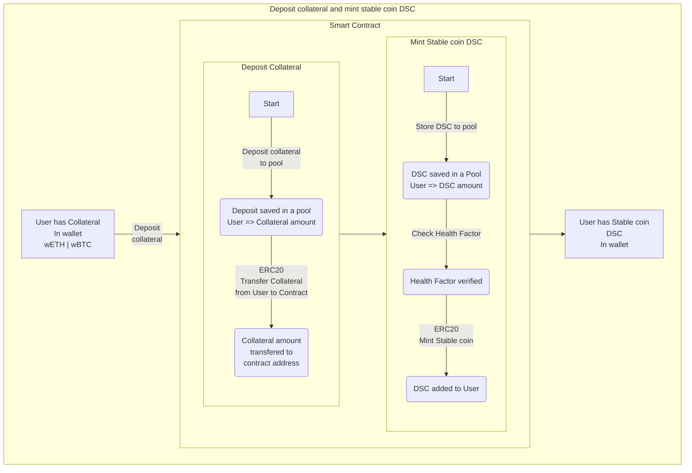
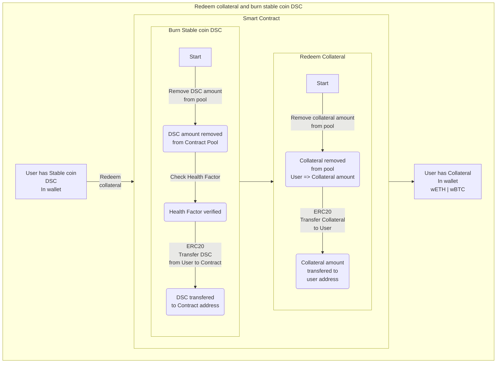
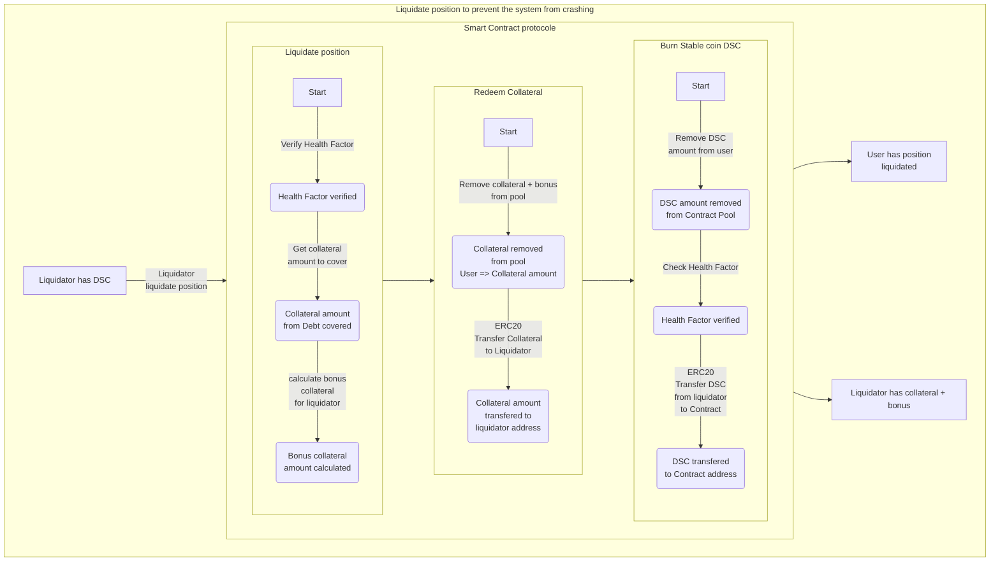

# A Decentralized Stable Coin (DSC) with Solidity

[](https://docs.soliditylang.org/en/v0.8.20/)


[
](https://github.com/ArnaudSene/solidity-foundry-dsc/actions/workflows/test.yml/releases/latest) 

[](https://github.com/ArnaudSene/solidity-foundry-dsc/actions/workflows/test.yml) 

[](https://github.com/ArnaudSene/solidity-foundry-dsc/actions/workflows/test.yml/actions/workflows/01-test.yml) 

---
# About
---

Creation of a decentralized stable coin (DSC) smart contract using the ERC20.

Here era the specifications

1. Relative stability: Anchored or Pegged (should be always worth $1.00)
   - Use Oracle Chainlink price feed
2. Stability mechanism (minting): Algorithmic (Decentralized)
   - People can only mint the stablecoin with enough collateral (coded)
3. Collateral: Exogenous (Crypto)
   - wETH 
      1. wrapped ETH
      2. wETH is the ERC-20 tradable version of ETH
      3. wETH is pegged to the price of ETH at a 1:1 ratio
   - wBTC
      1. wrapped BTC
      2. wBTC token was built using Ethereum’s ERC-20 token standard to provide bitcoin liquidity
      3. wBTC is bitcoin that has been converted for use on the Ethereum ecosystem. 
      4. wBTC is an Ethereum token that’s backed one-to-one by bitcoin (BTC), which means that one wBTC is always equal to one bitcoin.


# Summary
---

- [A Decentralized Stable Coin (DSC) with Solidity](#a-decentralized-stable-coin-dsc-with-solidity)
- [About](#about)
- [Summary](#summary)
- [Getting started](#getting-started)
  - [Requirements](#requirements)
- [Usage](#usage)
  - [Start a local node](#start-a-local-node)
  - [Deploy](#deploy)
  - [Deploy - Other Network](#deploy---other-network)
  - [Testing](#testing)
    - [Test Coverage](#test-coverage)
- [Deployment to a testnet or mainnet](#deployment-to-a-testnet-or-mainnet)
  - [Scripts](#scripts)
  - [Estimate gas](#estimate-gas)
- [Formatting](#formatting)
  - [Business Logic](#business-logic)
      - [Oracle](#oracle)
  - [Features](#features)
    - [Deposit collateral and Mint DSC](#deposit-collateral-and-mint-dsc)
    - [Redeem collateral and Burn DSC](#redeem-collateral-and-burn-dsc)
    - [Liquidation](#liquidation)

# Getting started
---

## Requirements

- [git](https://git-scm.com/book/en/v2/Getting-Started-Installing-Git)
- [foundry](https://book.getfoundry.sh/getting-started/installation)


# Usage
---

## Start a local node

```
make anvil
```

## Deploy

This will default to your local node. You need to have it running in another terminal in order for it to deploy.

```
make deploy
```

## Deploy - Other Network

[See below](#deployment-to-a-testnet-or-mainnet)

## Testing

We talk about 4 test tiers in the video.

1. Unit
2. Integration
3. Forked
4. Staging

In this repo we cover #1 and Fuzzing.

```
forge test
```

### Test Coverage

```
forge coverage
```

and for coverage based testing:

```
forge coverage --report debug
```

# Deployment to a testnet or mainnet

1. Setup environment variables

You'll want to set your `SEPOLIA_RPC_URL` and `PRIVATE_KEY` as environment variables. You can add them to a `.env` file, similar to what you see in `.env.example`.

- `PRIVATE_KEY`: The private key of your account (like from [metamask](https://metamask.io/)). **NOTE:** FOR DEVELOPMENT, PLEASE USE A KEY THAT DOESN'T HAVE ANY REAL FUNDS ASSOCIATED WITH IT.
  - You can [learn how to export it here](https://metamask.zendesk.com/hc/en-us/articles/360015289632-How-to-Export-an-Account-Private-Key).
- `SEPOLIA_RPC_URL`: This is url of the sepolia testnet node you're working with. You can get setup with one for free from [Alchemy](https://alchemy.com/?a=673c802981)

Optionally, add your `ETHERSCAN_API_KEY` if you want to verify your contract on [Etherscan](https://etherscan.io/).

1. Get testnet ETH

Head over to [faucets.chain.link](https://faucets.chain.link/) and get some testnet ETH. You should see the ETH show up in your metamask.

2. Deploy

```
make deploy ARGS="--network sepolia"
```

## Scripts

Instead of scripts, we can directly use the `cast` command to interact with the contract.

For example, on Sepolia:

1. Get some WETH

```
cast send 0xdd13E55209Fd76AfE204dBda4007C227904f0a81 "deposit()" --value 0.1ether --rpc-url $SEPOLIA_RPC_URL --private-key $PRIVATE_KEY
```

2. Approve the WETH

```
cast send 0xdd13E55209Fd76AfE204dBda4007C227904f0a81 "approve(address,uint256)" 0x091EA0838eBD5b7ddA2F2A641B068d6D59639b98 1000000000000000000 --rpc-url $SEPOLIA_RPC_URL --private-key $PRIVATE_KEY
```

3. Deposit and Mint DSC

```
cast send 0x091EA0838eBD5b7ddA2F2A641B068d6D59639b98 "depositCollateralAndMintDsc(address,uint256,uint256)" 0xdd13E55209Fd76AfE204dBda4007C227904f0a81 100000000000000000 10000000000000000 --rpc-url $SEPOLIA_RPC_URL --private-key $PRIVATE_KEY
```

## Estimate gas

You can estimate how much gas things cost by running:

```
forge snapshot
```

And you'll see an output file called `.gas-snapshot`

# Formatting

To run code formatting:

```
forge fmt
```


## Business Logic
#### Oracle
- get price feed from chainlink
  - See heartbeat value for collateral 
- Handle case when Oracle is unavailable
  - System must be blocked, no action is allowed


## Features

### Deposit collateral and Mint DSC

This feature allows the user to deposit a collateral amount, here *wETH* and/or *wBTC*, and obtain a stable coin *DSC* in exchange.
> User has wETH and/or wBTC in his wallet
> To get 1 *DSC* you must double the collateral



### Redeem collateral and Burn DSC
Redeemd is the process to get the collateral back to the user and burn the stablecoin for the minted stablecoin.
The redeem amount cannot exceed the amount deposited.



### Liquidation
The goal is to burn stablecoin held by user to improve their Health Factor H~f~ and prevent the system from crashing.
The liquidator, a third party, must holding the equivalent stablecoin to liquidate.

